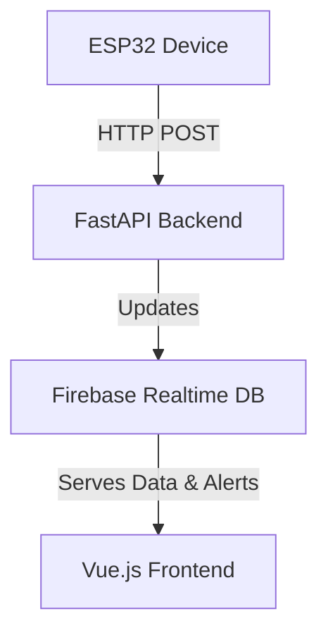

# 🐄 Smart Cattle Monitoring System

## Overview

A comprehensive IoT-based cattle monitoring system that tracks behavior, location, and movement patterns of cattle in real-time. The system uses ESP32 devices equipped with MPU6050 accelerometer and GPS modules to collect rich sensor data, which is processed through a FastAPI backend and stored in Firebase Realtime Database.

## 🏗️ System Architecture



### Components

1. **ESP32 Hardware Module**
   - MPU6050 accelerometer/gyroscope
   - GPS module (NEO-6M)
   - WiFi connectivity
   - Battery-powered
   - Waterproof enclosure

2. **FastAPI Backend**
   - RESTful API endpoints
   - Real-time data processing
   - Firebase integration
   - Behavior analysis
   - Geofencing support

3. **Firebase Realtime Database**
   - Real-time data storage
   - Activity history
   - Behavior patterns
   - Location tracking
   - Alert management

4. **Frontend Application**
   - Vue.js web dashboard
   - Real-time monitoring
   - Alert notifications
   - Interactive mapping

## 🔍 Features

### 1. Advanced Behavior Analysis
- Real-time behavior classification:
  - Resting
  - Grazing
  - Walking
  - Running
  - Alert/Unusual behavior
  - Predator threat detection
- Motion pattern analysis
- Confidence scoring

### 2. Activity Tracking
- Daily activity metrics
<<<<<<< HEAD
- Distance calculation
- Rest/active period monitoring
- Movement patterns
- Activity duration
=======
- Step counting
- Distance calculation
- Rest/active period monitoring
- Movement patterns
>>>>>>> 2c5db890a9cd94e0fcc2216b70b50ebeb05f5a2e

### 3. Location Services
- Real-time GPS tracking
- Geofencing
- Location history
- Movement paths
- Speed monitoring

### 4. Alert System
- Predator threat detection
- Unusual behavior alerts
- Geofence violations
- System status alerts
- Location-based alerts

## 🛠️ Technical Details

### ESP32 Device (cattle.ino)

```cpp
// Key Features
- 1-second sensor reading interval
- 30-second data transmission
- Low-pass motion filtering
- Behavior classification
- GPS integration
- Activity metrics
- JSON data formatting
```

### Backend API Endpoints

- `POST /cattle/live-data` - Receive ESP32 sensor data
- `GET /cattle` - Retrieve cattle information
- `GET /cattle-locations` - Get current locations
- `GET /alerts` - List active alerts
- `GET /staff` - Manage staff access
- `GET /geofences` - Handle boundary definitions
- `GET /dashboard/summary` - System overview

### Data Structure

```json
{
    "cattle_id": "cattle1",
    "timestamp": "2025-07-22T10:30:00Z",
    "location": {
        "latitude": -1.2921,
        "longitude": 36.8219,
        "speed_kmh": 2.5,
        "heading": 180.0,
        "gps_fix": true
    },
    "behavior": {
        "current": "walking",
        "previous": "grazing",
        "duration_seconds": 120,
        "confidence": 85.5
    },
    "activity": {
        "total_active_time_seconds": 3600,
        "total_rest_time_seconds": 1800,
<<<<<<< HEAD
=======
        "daily_steps": 1250,
>>>>>>> 2c5db890a9cd94e0fcc2216b70b50ebeb05f5a2e
        "daily_distance_km": 2.5
    }
}
```

## 📦 Installation

### Firebase Setup

1. **Create Firebase Project**
   1. Go to [Firebase Console](https://console.firebase.google.com/)
   2. Click "Create a project" or select an existing project
   3. Enable Realtime Database

2. **Generate Service Account Key**
   1. Go to Project Settings > Service Accounts
   2. Click "Generate new private key"
   3. Save the key as `serviceAccount.json`

3. **Configure Database**
   ```javascript
   // Database Structure
   {
     "cattle": {
       "cattle1": { /* cattle summary */ }
     },
     "cattle_live_data": {
       "cattle1": { /* real-time sensor data */ }
     },
     "alerts": { /* alert records */ },
     "staff": { /* staff records */ },
     "geofences": { /* boundary definitions */ }
   }
   ```

### ESP32 Setup

1. **Hardware Assembly**
   ```bash
   # Required Components
   - ESP32 DevKit
   - MPU6050 Module
   - NEO-6M GPS
   - Battery Pack
   - Waterproof Case
   ```

2. **Arduino Configuration**
   - Install required libraries
   - Configure WiFi settings
   - Set backend URL
   - Flash ESP32

### Backend Setup

1. **Environment Setup**
   ```bash
   python -m venv env
   source env/bin/activate  # or env\Scripts\activate on Windows
   pip install -r requirements.txt
   ```

2. **Configuration**
   ```bash
   # .env file
   FIREBASE_CREDENTIALS=path/to/serviceAccount.json
   BACKEND_URL=http://your-server:8001
   ```

3. **Run Server**
   ```bash
   python -m uvicorn main:app --host 0.0.0.0 --port 8001
   ```

## 🔧 Configuration

### ESP32 Network Settings
```cpp
// cattle.ino
const char* ssid = "your_wifi_ssid";
const char* password = "your_wifi_password";
const String BACKEND_URL = "http://your_server:8001";
```

### Backend Settings
```python
# main.py
settings = {
    'firebase_url': 'your-firebase-url',
    'api_key': 'your-api-key',
    'update_interval': 30  # seconds
}
```

## 📊 Monitoring

### System Health Checks
- ESP32 battery level
- WiFi connection strength
- GPS signal quality
- Sensor calibration
- Backend server status
- Database connectivity

### Performance Metrics
- Data transmission success rate
- Behavior classification accuracy
- Battery life estimation
- GPS fix reliability
- System response time

## 🔐 Security

- WiFi WPA2 encryption
- HTTPS API endpoints
- Firebase authentication
- API key validation
- Geofence verification
- Data encryption

##  Future Enhancements

1. **Machine Learning**
   - Behavior prediction
   - Movement pattern analysis
   - Grazing pattern optimization
   - Predator threat prediction

2. **Hardware**
   - Solar power integration
   - Extended battery life
   - Environmental sensors
   - Mesh networking

3. **Software**
   - Offline data storage
   - Advanced analytics
   - Multi-language support
   - Mobile app development

## 📄 License

This project is licensed under the MIT License - see the LICENSE file for details.

## 👥 Contributors

- Backend Development Team
- IoT Hardware Team
- Frontend Development Team
- System Integration Team

## 📞 Support

For technical support or questions:
- Create an issue in the repository
- Contact the development team
- Check the documentation

---

*Last Updated: July 22, 2025*  
*Version: 1.0.0*  
*Status: Production Ready*
3. Save the JSON file as `firebase-service-account-key.json` in your project root
4. Keep this file secure and never commit it to version control

## 3. Update Environment Variables
Update the `.env` file with your Firebase project details:
```
FIREBASE_SERVICE_ACCOUNT_KEY_PATH=firebase-service-account-key.json
FIREBASE_DATABASE_URL=https://your-project-id-default-rtdb.firebaseio.com/
```

## 4. Firestore Security Rules (Optional)
If using Firestore, update your security rules in the Firebase Console:
```javascript
rules_version = '2';
service cloud.firestore {
  match /databases/{database}/documents {
    match /{document=**} {
      allow read, write: if true; // For development only
    }
  }
}
```

## 5. Run the Application
```bash
uvicorn main:app --reload
```

## API Endpoints

### Firestore Operations
- `POST /firestore/{collection_name}/{document_id}` - Create document
- `GET /firestore/{collection_name}/{document_id}` - Get document
- `PUT /firestore/{collection_name}/{document_id}` - Update document
- `DELETE /firestore/{collection_name}/{document_id}` - Delete document
- `GET /firestore/{collection_name}` - Get all documents in collection

### Realtime Database Operations
- `POST /realtime/{path}` - Set data at path
- `GET /realtime/{path}` - Get data from path

### Example Usage
```bash
# Create a user document
curl -X POST "http://localhost:8000/firestore/users/user1" \
  -H "Content-Type: application/json" \
  -d '{"data": {"name": "John Doe", "email": "john@example.com", "age": 30}}'

# Get a user document
curl -X GET "http://localhost:8000/firestore/users/user1"

# Update a user document
curl -X PUT "http://localhost:8000/firestore/users/user1" \
  -H "Content-Type: application/json" \
  -d '{"data": {"name": "John Smith", "age": 31}}'

# Get all users
curl -X GET "http://localhost:8000/firestore/users"
```
